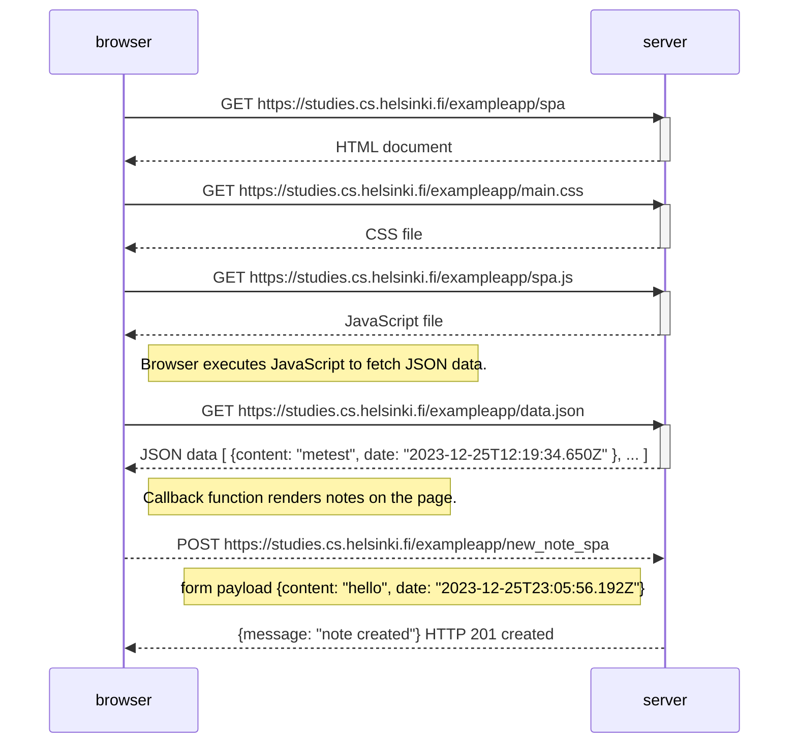

User creates a new note in single note app

```mermaid
   sequenceDiagram
    participant browser
    participant server

    browser->>server: GET https://studies.cs.helsinki.fi/exampleapp/spa

    activate server
    server-->>browser: HTML document
    deactivate server

    browser->>server: GET https://studies.cs.helsinki.fi/exampleapp/main.css

    activate server
    server-->>browser: CSS file
    deactivate server

    browser->>server: GET https://studies.cs.helsinki.fi/exampleapp/spa.js

    activate server
    server-->>browser: JavaScript file
    deactivate server

    Note right of browser: Browser executes JavaScript to fetch JSON data.

    browser->>server: GET https://studies.cs.helsinki.fi/exampleapp/data.json
    activate server
    server-->>browser: JSON data [ {content: "metest", date: "2023-12-25T12:19:34.650Z" }, ... ]
    deactivate server

    Note right of browser: Callback function renders notes on the page.


    browser-->>server : POST https://studies.cs.helsinki.fi/exampleapp/new_note_spa

    Note left of server : form payload {content: "hello", date: "2023-12-25T23:05:56.192Z"}
    server-->>browser: {message: "note created"} HTTP 201 created 
```